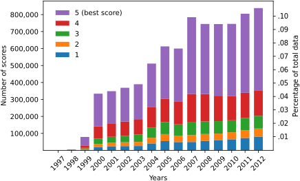

# Amazon movie reviews

Readers for prepared data are documented here:

- [Amazon Pickle Reader](notebooks/amazon_pickle_reader.ipynb) (including available IDs and keys)
- [Amazon Pickle Splitter](notebooks/amazon_pickle_splitter.ipynb) (including overview of prepared data)

The original data can be downloaded here:

- [https://snap.stanford.edu/data/web-Movies.html](https://snap.stanford.edu/data/web-Movies.html)
- [https://snap.stanford.edu/data/movies.txt.gz](https://snap.stanford.edu/data/movies.txt.gz)

### Original data insights

```
    1997   1998   1999   2000   2001   2002   2003   2004   2005   2006   2007   2008   2009   2010   2011   2012 
1      6    191   4844  19944  24221  25311  25734  41016  54744  49049  49521  56076  59099  65343  72957  81276 
2      1    262   3631  17808  20320  22641  24183  33117  40868  37992  40205  40138  39680  41430  45767  47356 
3      8    442   6458  30907  35395  37798  43323  60489  71012  66128  75239  74057  73178  70279  72055  74826 
4     29    797  14178  73314  79152  84276  90527 119160 138000 135581 167632 161693 149771 142000 148457 150248 
5     64   3313  49866 192002 189638 198712 205916 257603 308080 311252 452009 412870 422403 426248 465918 484650 
```



[Image source](https://github.com/EML4U/Drift-detector-comparison/tree/main/figures/amazon-overview)